# Predicting Comment Removal from Reddit r/worldnews: January 2019

## Overview (tl;dr)
*	Using natural language processing techniques, classification models, and transfer learning, I predict whether or not moderators will remove user comments from the r/worldnews subreddit for the month of January 2019. 
*	My results imply that in addition to word importance based on term frequency-inverse document frequency (tf-idf), both the contextual meaning behind words and non-textual features also play an important role in predicting comment removal. 

### Table of Contents  
[Description](#description)  
[Data Preparation](#data-preparation)   
[Exploratory Data Analysis](#exploratory-data-analysis) 
[Modeling Approach](#modeling-approach) 
[Modeling Results](#modeling-results) 
[Summary](#summary)

## Description

Reddit is a website that aggregates news and social content and provides a platform for discussion. Although basically any topic can be discussed on Reddit, the site is heavily moderated. Users report offensive and abusive comments or comments that otherwise violate subreddit rules to moderators, who then review these comments and decide whether or not to remove them. 

This project predicts whether or not comments from Reddit’s r/worldnews subreddit will be removed, in order to potentially reduce the amount of user and moderator work and make the subreddit a friendlier environment. In particular, I investigate whether or not textual features from the comments themselves as well as non-textual features are predictive of comment removal. I use natural language processing techniques, classification models, and transfer learning.

My workflow process is outlined below: 

I first retrieve and clean my data, perform exploratory data analysis (EDA), use EDA to inform my feature engineering, and then perform modeling comparing a term frequency-inverse frequency (tf-idf) vs. word embeddings approach. In addition to text-only features, I also suspect that other factors may help predict comment removal. Therefore for each of these models I investigate the effect of using comment text only vs. also adding engineered non-text features. 

## Data Preparation

My data collection process involves first querying both removed and intact comments from r/worldnews for the month of January 2019 from Google BigQuery. In order to restore specifically moderator-removed comments (marked with "[removed]"), I next retrieved the original body text for these comments through Reddit's pushshift.io API. 

I then merged these comments with intact ones and removed unnecessary columns. Next I removed automoderator-flagged (comments that generated an automatic response or were automatically flagged as spam: these comments did not contain the original textual context), user-deleted (marked by "[deleted]" in the text body), and otherwise missing (unrestorable) comments. I also removed comments containing website links: the terms of the site dictate that irrelevant or offensive links will get removed.

Lastly, I created my target variable as a flag indicating whether or not a comment has been removed (1 = removed, 0 = intact). 

After data cleaning, my final dataset comprises 778,592 total comments, of which 23,885 (3%) are removed by moderators. I discuss different techniques I use to address this class imbalance later on in the modeling phase.

## Exploratory Data Analysis & Feature Engineering

### Textual Features

A few examples of removed comments are below:

"Lmao did I trigger you *** *** ? Go back to shaving with Gillette”

“You people are deranged”

“Not an argument.”

“Perhaps finally some justice.”

The first two comments above can be easily construed as insulting. The last two, at least taken out of context, don't seem directly offensive, but they could be if we do consider the context.

In terms of tf-idf-based word importance, intact and removed comments share some words in common, such as “people”, "think", and "country". However, removed comments feature more profanity and prejudice-oriented words compared to intact comments, as shown in the wordclouds below.

**Intact Comments**

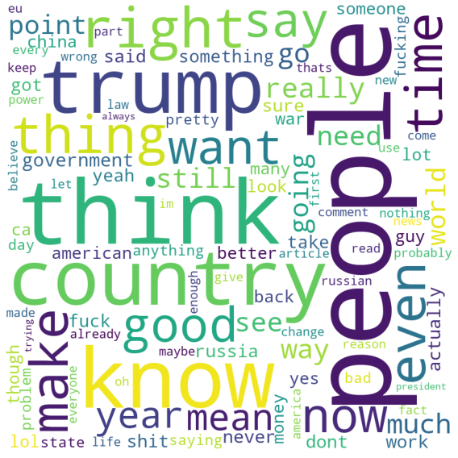

**Removed Comments**

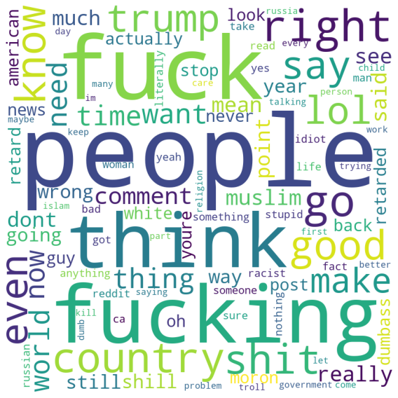

I then perform text featurization using my comment data. My pipeline is below:
1) Normalize text to convert comments into more uniform sequences
2) Remove punctuation, unnecessary characters, and stopwords
3) Lowercase and lemmatize words
4) Create tf-idf matrices.

### Non-textual Features

Next I explore the non-textual features in my dataset. The available datafields are author, comment id, parent id (parent comment nested immediately above), comment score, and posting date.

I first investigate how responses to removed comments are treated. Are these responses more likely to be removed themselves? To answer this question, I flag all first- through fifth-level child responses to removed comments. As we see below, first-level responses to removed comments are the most common, and decrease exponentially as we move through lower nested responses. 

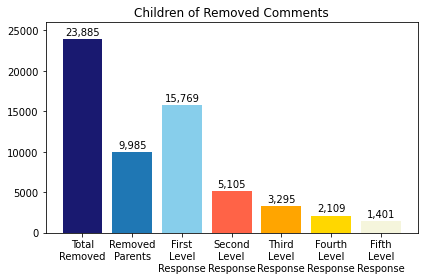

Based on the below graph, 45% of first-level responses to removed comments are also removed themselves. This is a much larger proportion than the 3% of overall comments that are removed by moderators. Although it’s possible that responses to removed comments are also more likely to be perceived as offensive, 45% seems like a high proportion. This implies that moderators may be more inclined to remove responses to previously removed parent comments, regardless of the perceived offensiveness of such responses. 

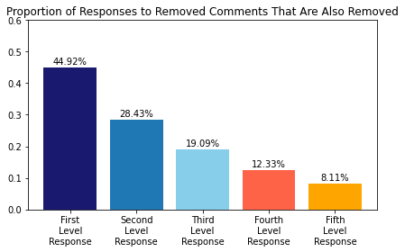

The percentage of comment removal decreases as we move through lower-level responses, possibly due to decreased visibility.  

I next investigate the number and proportion of removed comments at the user-level. Unsurprisingly, most users post comments that aren't removed, and only 13,377 (7.8%) of 170,652 users post at least one removed comment. However, out of these 13,377 users, 3,878 users (28%) are "repeat offenders", i.e., they posted more than one removed comment. 

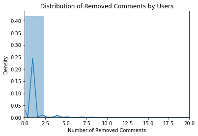     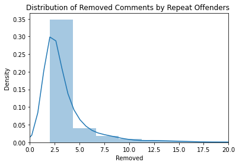

One question I had was: do moderators punish these "repeat offenders"? That is, if a given user has a historically high rate of comment removal, then are moderators more inclined to remove future comments from that user? To answer this question, I calculate the number and proportion of previously removed and total comments for each user and comment. 

I also investigate how attributes like word/character length and scores differ between intact and removed comments. Based on the below graphs, there aren’t significant differences between the two distributions. 

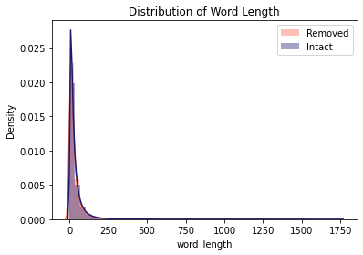      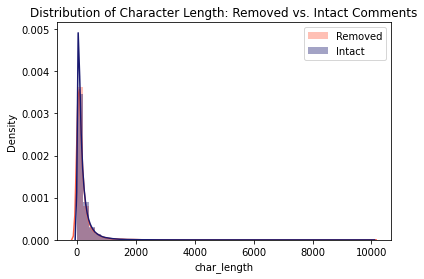       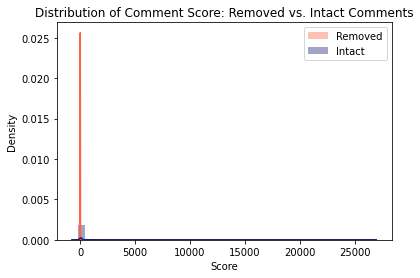

Lastly, I look at how my features correlate with one another. Although the running proportion of removed to total comment variables by author and date are highly correlated with the "Removed" target variable, including these in the model would introduce data leakage. The best alternative is to include the **previous** proportion of removed comments for each user and posting date. My final feature selection includes the first- through fifth-level responses of removed comments, number and proportion of previously removed comments by user and posting date, and number of previous comments by user and posting date.

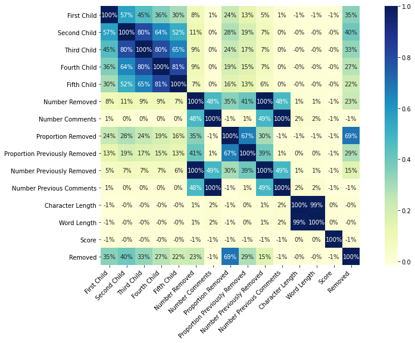

## Modeling Approach

I use two types of modeling approaches:
1) Term Frequency-Inverse Document Frequency (tf-idf)
2) Word Embeddings

### TF-IDF
For each word and comment pair, tf-idf measures how important that word is to a given comment. It increases proportionally to how frequently a word appears in a comment, but is simultaneously offset by the number of comments that contain the word. Therefore, words that appear frequently in many comments have relatively low tf-idf scores, since they aren't meaningful to any given comment in particular.

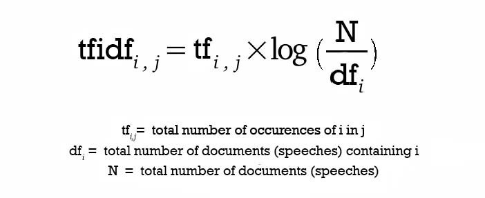

I use stratified k-fold cross validation on the training dataset (from a stratified 80% - 20% train-test split), and compare approaches using no undersampling vs. undersampling, and unigrams (single words) vs. bigrams (word pairings). Before running models, I first account for the target variable class imbalance through stratified train-test-split and stratified k-fold cross validation approaches. In order to yield a reliable estimate of model performance, stratification maintains the same class distribution in each split of the data as that in the original dataset. This is especially important for imbalanced classes, where any deviations from the existing imbalance in a given split can result in performance that is inconsistent with that of other splits and not reflective of true performance. (On the other hand, for balanced classes stratification is equivalent to random sampling.) I also compare model performance using both no undersampling and undersampling methods. Undersampling randomly removes examples from the majority class (intact comments) until the distribution of class values is evenly split. 

I use four models, including a baseline dummy classifier, logistic regression, random forest, and gradient boosting classifier. My baseline dummy classifier generates predictions using probabilities based on the training set’s class distribution.

### Word Embeddings
Word embeddings transform words into numerical vectors so that words with similar meaning also have similar representation in the vector space. In doing so, word embeddings capture the contextual meaning underlying these words. This context is not captured by tf-idf or other bag-of-words models. 

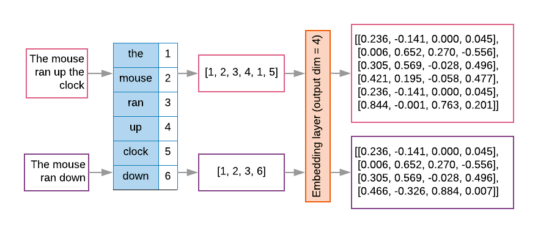

For this approach I use a set of word embeddings pretrained on Wikipedia articles: https://wikipedia2vec.github.io/wikipedia2vec/intro/ Based on the pre-trained embeddings, we can see what some of the most similar words to the most "important" words in our corpus are, using Word2Vec cosine similarity.

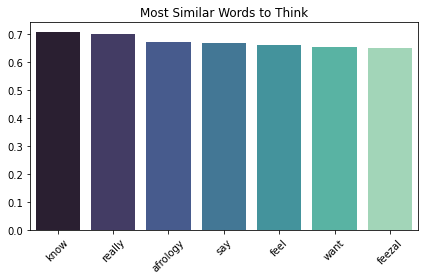     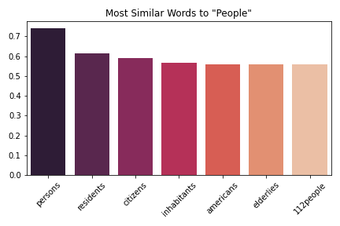    

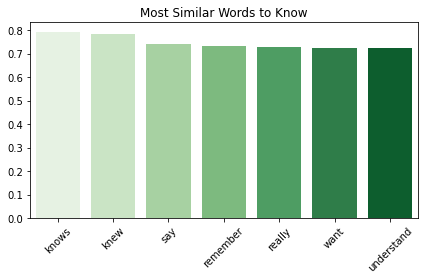    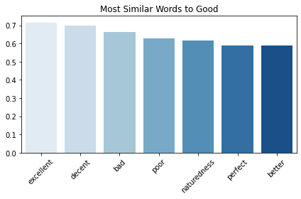

Although there are a few interesting ones, most of these words are semantically similar to their respective neighboring words. These vectors seem to capture the contextual meaning behind these words fairly well. 

I use a convolutional neural network (CNN) as my model, and incorporate word embeddings as an additional layer in the CNN. I use 1 convolutional layer, F1 loss, twenty epochs, Adam optimizer, and default parameters. 

In terms of evaluation metrics, it’s not clear whether false positives or false negatives are more important in this case: both removing comments that shouldn’t have been removed and not removing comments that should have been removed would likely annoy Reddit users either way. To be conservative, I use F1 scores to evaluate model performance.  

## Modeling Results

### TF-IDF

My tf-idf-based modeling results (shown below) compare performance using no undersampling with undersampling, and unigrams with bigrams. 

I first investigate the effect of purely textual features. The model that yields the highest weighted F1 score is Random Forest using bigrams and no undersampling, with an F1 of 0.960, precision of 0.958, and recall of 0.969. These results show a 2% improvement over baseline F1, precision, and recall scores of 0.94. The F1 score for the positive (removed comments) class is 0.201, which is a six-fold increase over baseline F1, precision, and recall scores of 0.028. 

            

            

I then incorporate non-textual features into my models. The model that yields the highest weighted F1 score is Logistic Regression using unigrams and no undersampling, with an F1 score of 0.971, precision of 0.972, and recall of 0.976. The results show a 1.1% increase over the best model using only textual features (Random Forest using bigrams and no undersampling, with an F1 score of .960). However, the F1 score for the removed comments class is 0.444, a more than two-fold increase compared to the best model without textual features (Random Forest with an F1 of 0.201). Incorporating textual features increased overall predictive power slightly, but drastically improved how well the model can identify comments that should get removed.

            

            

### Word Embeddings

My embedding-based modeling results use pretrained word embeddings on a CNN model, and compare text-only features with both text and non-text features. 

Using just text features yields a weighted F1 of 0.961, weighted precision of 0.958, weighted recall of 0.964, and F1 for the removed comments class of 0.304. Compared to my "best" tf-idf model using text features (random forest using bigrams), weighted F1 scores increased by 0.1% and F1 scores for removed comments increased by 51.2%. 

Using both text and non-text features yields a weighted F1 of 0.971, weighted precision of 0.971, weighted recall of 0.974, and F1 for the removed comments class of 0.505. Compared to my "best" tf-idf model using both text and non-text features (logistic regression using unigrams), weighted F1 scores increased by 0.1%, and F1 scores for the removed comments class increased by 13.7%. 

## Summary

### Implications

My results imply the following: 
1) Generally my models predict which comments will stay on r/worldnews very well, and predicts which comments will get removed less well.
2) Adding nontextual features such as user information and comment nesting structure increased overall predictive power, especially for the positive (removed comments) class 
3) Adding some context to words through the use of pretrained word embeddings and more complex neural network models also increased overall predictive power, including the positive (removed comments) class. 

The largest incremental increase in predictive power comes from the addition of nontextual features, with weighted F1 scores for the positive class more than doubling in some cases. Incorporating word context results in a relatively smaller increase in predictive power. More information related to user accounts (date of account creation, verified email status, comment karma, etc.) from the January 2019 timeframe may be helpful in further boosting predictive power.

However, even after incorporating additional features there may still be a lingering residual component that limits predictive power for the positive class. First off, there can be variation in what users and moderators consider offensive, and this subjectivity may also vary from subreddit to subreddit. Additionally, comments may be offensive in certain contexts but not others. A comment like "Perhaps finally some justice" isn't directly offensive taken out of context, but taken as a response to another comment or post, the underlying meaning may be completely different. 

### Future Directions

Potential future directions include the following: 

* Fine tune hyperparameters (learning rate, optimizer, number of layers, loss functions) and precision-recall tradeoff for CNN models.
* Experiment with higher-order n-grams and sampling methods.
* Experiment with other models (LSTM, RNN) and implement word embeddings in existing models (logistic regression, random forest).
* Experiment with other types of pretrained embeddings (Google Word2Vec, GloVe, fasttext) and/or character-level embeddings.
* Find historical user account metadata if available.

