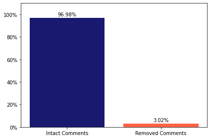

# Predicting Comment Removal from Reddit r/worldnews: January 2019

### Table of Contents  
[Description](#description)  
[Data Preparation](#data-preparation)   
[Exploratory Data Analysis](#exploratory-data-analysis) 
[Modeling Approach](#modeling-approach) 
[Modeling Results](#modeling-results) 
[Summary](#summary)

## Overview (TL;DR)

*	Using natural language processing techniques and supervised learning models such as logistic regression, random forest, gradient boosting, and Naive-Bayes classification, I predict whether or not user comments will get removed from the r/worldnews subreddit for the month of January 2019. 
*	The model that yields the highest F1 score for the removed comments class is Random Forest using bigrams and no undersampling, with an F1 score of 0.203, precision of 0.481, and recall of 0.129. These results show improvement over baseline F1, precision, and recall scores of 0.029.
*	After maximizing for F1 scores across a range of decision thresholds, the model that yields the highest F1 score is Logistic Regression using bigrams and no undersampling, with an F1 score of 0.298, precision of 0.281, recall of 0.316, and decision threshold of 0.103.

## Description

Reddit is a website that aggregates news and social content and provides a platform for discussion. Although basically any topic can be discussed on Reddit, the site is heavily moderated. Users report offensive and abusive comments or comments that otherwise violate subreddit rules to moderators, who then review these comments and decide whether or not to remove them. 

This project predicts whether or not comments from Reddit’s r/worldnews subreddit will be removed, in order to potentially reduce the amount of user and moderator work. In particular, I investigate whether or not textual features from the comments themselves are predictive of comment removal, using natural language processing techniques and supervised learning models such as logistic regression, random forest, gradient boosting, and Naive-Bayes classification. 

## Data Preparation

My dataset comprises 826,163 total comments, of which 24,952 (3%) are removed by moderators. I discuss different techniques I use to address the class imbalance later on in the modeling phase. 

My data collection process involves first querying both removed and intact comments from r/worldnews for the month of January 2019 from Google BigQuery. In order to restore specifically moderator-removed comments (marked with "[removed]"), I next retrieved the original body text for these comments through Reddit's pushshift.io API. 

I then merged these comments with intact ones and removed unnecessary columns. Next I removed automoderator-flagged comments (comments that generated an automatic response or were automatically flagged as spam: these comments did not contain the original textual context), user-deleted (marked by "[deleted]" in the text body), and otherwise missing (removed comments that could not be restored) comments. Lastly, I created my target variable as an indicator showing whether or not a comment has been removed (1 = removed, 0 = intact). 

My text featurization pipeline is as follows:
1) Normalize text to convert comments into more uniform sequences
2) Remove punctuation, unnecessary characters, and stopwords
3) Lowercase and lemmatize words
4) Create bag of words and term frequency-inverse document frequency (tf-idf) matrices.

## Exploratory Data Analysis

A few examples of removed comments are below:

"Lmao did I trigger you soy boy? Go back to shaving with Gillette”

“You people are deranged”

“Not an argument.”

“Perhaps finally some justice.”

The first two comments above can be easily construed as insulting. The last two, at least taken out of context, don't seem directly offensive, but they could be if we do consider the context.

In terms of word importance, intact and removed comments share some words in common, such as "think", "know", and "country". However, removed comments feature more profanity, more mentions of "Trump", and more prejudice-oriented words compared to intact comments, as shown in the wordclouds below.

           

## Modeling Approach

My modeling framework uses stratified k-fold cross validation on the training dataset (from a stratified 80% - 20% train-test split), and compares approaches using no undersampling vs. undersampling, and unigrams (single words) vs. bigrams (word pairings). Before running models, I first account for the target variable class imbalance through stratified train-test-split and stratified k-fold cross validation approaches. In order to yield a reliable estimate of model performance, stratification maintains the same class distribution in each split of the data as that in the original dataset. This is especially important for imbalanced classes, where any deviations from the existing imbalance in a given split can result in performance that is inconsistent with that of other splits and not reflective of true performance. (On the other hand, for balanced classes stratification is equivalent to random sampling.) I also compare model performance using both no undersampling and undersampling methods. Undersampling randomly removes examples from the majority class (intact comments) until the distribution of class values is evenly split. 

I use five models, including a baseline dummy classifier, logistic regression, random forest, gradient boosting, and Naïve-Bayes. My baseline dummy classifier generates predictions using probabilities based on the training set’s class distribution.

In terms of evaluation metrics, it’s not clear whether false positives or false negatives are more important in this case: both removing comments that shouldn’t have been removed and not removing comments that should have been removed would likely annoy Reddit users either way. To be conservative, I use precision, recall, and F1 scores to evaluate model performance. 

## Modeling Results

My modeling results (shown below) compare no undersampling with undersampling, and unigrams with bigrams. For the no undersampling approaches, we see high precision and low recall, but for the undersampling approaches, we see low precision and high recall. The model that yields the highest F1 score for my "Removed" comments class is Random Forest using bigrams and no undersampling, with an F1 score of 0.203, precision of 0.481, and recall of 0.129. These results show improvement over a baseline F1 score, precision, and recall of 0.029.

            

            

### Modeling Results: Optimal Decision Thresholds

Using the same modeling framework described above, I then evaluated model performance across a range of decision thresholds to maximize the precision-recall tradeoff (F1 scores) across all models and approaches. The model that yields the highest F1 score is Logistic Regression using bigrams and no undersampling, with an F1 score of 0.298, precision of 0.281, recall of 0.316, and decision threshold of 0.103.

        

        

## Summary

### Implications

Although the modeling results above show considerable improvements over the baseline, the F1 scores themselves aren't especially high. Potential reasons include subjectivity related to comment offensiveness, missing context, missing predictors, and/or textual nuances not fully captured by the bag-of-words model. First off, there may be variation in what users and moderators consider offensive, and this subjectivity may also vary from subreddit to subreddit. While other users may not be as offended, a few users might get especially triggered by a given comment and report it multiple times, which may heighten the overall likelihood of removing that comment. Additionally, comments may be offensive in certain contexts but not others. A comment like "Perhaps finally some justice" isn't directly offensive taken out of context, but taken as a response to another comment or post, the underlying meaning may be completely different. It’s also possible that there exist more complex interactions within the text that the bag-of-words model doesn’t capture, so it'd be interesting to look at other models to see if we can represent these relationships more accurately.

### Next Steps

In terms of next steps, there are several things to potentially explore. Other than comments, I also have data on authors and comment scores, which could be other features to add to the models. Also, if there is a way to match comments to surrounding comments or parent posts and map out the underlying nesting structure, then we may be able to capture the surrounding context of these comments and incorporate that into the models. We can also fine tune hyperparameters, try out other sampling methods, or experiment with higher-order n-grams. Lastly, it’d be interesting to explore other models such as simple, convolutional (CNN), or recurrent (RNN) neural networks; long-short term memory cell (LSTM); and/or character/word-level embeddings to possibly capture more complex textual relationships and increase predictive power.

