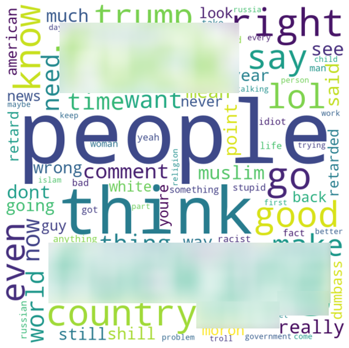

# Predicting Comment Removal from Reddit r/worldnews: January 2019

### Table of Contents  
[Description](#description)  
[Data Preparation](#data-preparation)   
[Exploratory Data Analysis](#exploratory-data-analysis) 
[Modeling Approach](#modeling-approach) 
[Results](#results) 
[Summary](#summary)

## Description

Reddit is a website that aggregates news and social content and provides a platform for discussion. Although basically any topic can be discussed on Reddit, the site is heavily moderated. Users report offensive and abusive comments or comments that otherwise violate subreddit rules to moderators, who then review these comments and decide whether or not to remove them. 

This project predicts whether or not comments from Reddit’s r/worldnews subreddit will be removed, in order to potentially reduce the amount of user and moderator work. In particular, I investigate whether or not textual features from the comments themselves are predictive of comment removal, using supervised learning models such as logistic regression, random forest, gradient boosting, and Naive-Bayes classification. 

## Data Preparation

My dataset comprises 826,163 total comments, of which 24,952 (3%) are removed by moderators. I discuss different techniques I use to address the class imbalance later on in the modeling phase. 

My data collection process involves first querying both removed and intact comments from r/worldnews for the month of January 2019 from Google BigQuery. In order to restore specifically moderator-removed comments (marked with "[removed]"), I next retrieved the original body text for these comments through Reddit's pushshift.api. 

I then merged these comments with intact ones and removed unnecessary columns. Next I removed automoderator-flagged comments (comments that generated an automatic response or were automatically flagged as spam: these comments did not contain the original textual context), user-deleted (marked by "[deleted]" in the text body), and otherwise missing (removed comments that could not be restored) comments. Lastly, I created my target variable as an indicator showing whether or not a comment has been removed (1 = removed, 0 = intact). 

My text featurization pipeline is as follows:
1) Normalize text to convert comments into more uniform sequences
2) Remove punctuation, unnecessary characters, and stopwords
3) Lowercase and lemmatize words
4) Create bag of words and term frequency-inverse document frequency (tf-idf) matrices.

## Exploratory Data Analysis

A few examples of removed comments are below:

"Lmao did I trigger you soy boy? Go back to shaving with Gillette”

“You people are deranged”

“Not an argument.”

“Perhaps finally some justice.”

The first two comments above can be easily construed as insulting. The last two, at least taken out of context, don't seem directly offensive, but they could be if we do consider the context.

In terms of word importance, intact and removed comments share some words in common, such as "think", "know", and "country". However, removed comments feature more profanity, more mentions of "Trump", and more prejudice-oriented words compared to intact comments.

           

## Modeling Approach

My modeling framework uses stratified k-fold cross validation on the training dataset (from a stratified 80% - 20% train-test split), and compares approaches using no undersampling vs. undersampling, and unigrams (single words) vs. bigrams (word pairings). Before running models, I first account for the target variable class imbalance through stratified train-test-split and stratified k-fold cross validation approaches. In order to yield a reliable estimate of model performance, stratification maintains the same class distribution in each split of the data as that in the original dataset. This is especially important for imbalanced classes, where any deviations from the existing imbalance in a given split can result in performance that is inconsistent with that of other splits and not reflective of true performance. I also compare model performance using both no undersampling and undersampling methods. Undersampling randomly removes examples from the majority class (intact comments) until the distribution of class values is evenly split. 

I use five models, including a baseline dummy classifier, logistic regression, random forest, gradient boosting, and Naïve-Bayes. My baseline dummy classifier generates predictions using probabilities based on the training set’s class distribution.

In terms of evaluation metrics, it’s not clear whether false positives or false negatives are more important in this case: both removing comments that shouldn’t have been removed and not removing comments that should have been removed would likely annoy Reddit users either way. To be conservative, I use precision, recall, and F1 scores to evaluate model performance. 

