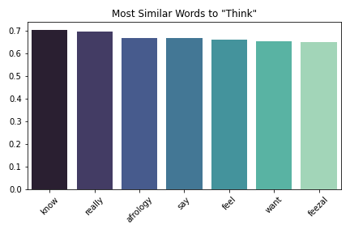
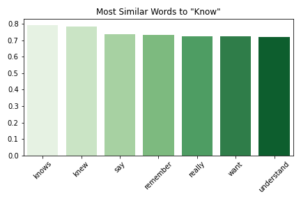
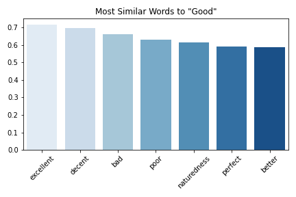

# Predicting Comment Removal from Reddit r/worldnews: January 2019

## Overview (tl;dr)
*	Using natural language processing techniques and supervised and unsupervised learning models, I predict whether or not user comments will get removed from the r/worldnews subreddit for the month of January 2019. 
*	My results imply that in addition to individual word features, the contextual meanings behind words and non-textual features also play an important role in predicting comment removal. 

### Table of Contents  
[Description](#description)  
[Data Preparation](#data-preparation)   
[Exploratory Data Analysis](#exploratory-data-analysis) 
[Modeling Approach](#modeling-approach) 
[Modeling Results](#modeling-results) 
[Summary](#summary)

## Description

Reddit is a website that aggregates news and social content and provides a platform for discussion. Although basically any topic can be discussed on Reddit, the site is heavily moderated. Users report offensive and abusive comments or comments that otherwise violate subreddit rules to moderators, who then review these comments and decide whether or not to remove them. 

This project predicts whether or not comments from Reddit’s r/worldnews subreddit will be removed, in order to potentially reduce the amount of user and moderator work. In particular, I investigate whether or not textual and non-textual features from the comments themselves are predictive of comment removal. I use natural language processing techniques and models such as logistic regression, random forest, and gradient boosting; and neural network models such as simple neural networks and convolutional neural networks (CNNs).  

## Data Preparation

My data collection process involves first querying both removed and intact comments from r/worldnews for the month of January 2019 from Google BigQuery. In order to restore specifically moderator-removed comments (marked with "[removed]"), I next retrieved the original body text for these comments through Reddit's pushshift.io API. 

I then merged these comments with intact ones and removed unnecessary columns. Next I removed automoderator-flagged (comments that generated an automatic response or were automatically flagged as spam: these comments did not contain the original textual context), user-deleted (marked by "[deleted]" in the text body), and otherwise missing (removed comments that cannot be restored) comments. I also removed comments containing website links: the terms of the site dictate that irrelevant or offensive links will get removed, as seen below.

Lastly, I created my target variable as an indicator showing whether or not a comment has been removed (1 = removed, 0 = intact). 

After data cleaning, my final dataset comprises 778,592 total comments, of which 23,885 (3%) are removed by moderators. I discuss different techniques I use to address this class imbalance later on in the modeling phase.

My text featurization pipeline is as follows:
1) Normalize text to convert comments into more uniform sequences
2) Remove punctuation, unnecessary characters, and stopwords
3) Lowercase and lemmatize words
4) Create bag of words term frequency-inverse document frequency (tf-idf) matrices.

## Exploratory Data Analysis

### Textual Features

A few examples of removed comments are below:

"Lmao did I trigger you soy boy? Go back to shaving with Gillette”

“You people are deranged”

“Not an argument.”

“Perhaps finally some justice.”

The first two comments above can be easily construed as insulting. The last two, at least taken out of context, don't seem directly offensive, but they could be if we do consider the context.

In terms of word importance, intact and removed comments share some words in common, such as “people”, "think", and "country". However, removed comments feature much more profanity and prejudice-oriented words compared to intact comments, as shown in the wordclouds below.

           

### Non-textual Features

I next investigate the non-textual features in my dataset. A snapshot is below:

I first investigate the number and proportion of removed comments at the user-level. Most users post comments that don't get removed, and only 13,377 (7.8%) of 170,652 users post at least one removed comment. However, out of these 13,377 users, 3,878 users (28%) are "repeat offenders", i.e., they posted more than one removed comment.

     

Moderators may punish these "repeat offenders": if a given user has a historically high rate of comment removal, then moderators be more inclined to remove future comments from that user. Therefore, for each user and posting date, I calculate the proportion of previously removed comments. 

Additionally, moderators may remove responses to removed parent comments, regardless of the perceived "offensiveness" of such responses. To account for this, I flag all first- through fifth-level child responses to removed comments. I expect to see diminishing marginal returns as we traverse further down the nesting structure. 

As we see from the below left graph, first-level responses to removed comments are the most common, and decrease exponentially as we move through lower nested responses. 

45% of first-level responses to removed comments also get removed themselves. This is a much larger proportion than the 3% of overall comments that are removed by moderators. Although it’s possible that responses to removed comments are also more likely to be perceived as offensive, 45% seems like a high proportion. 

The percentage of comment removal decreases as we move through lower-level responses. This is reasonable if we consider that first-level responses are also the most visible to both moderators and users, and are therefore more likely to get removed than lower-level responses. 

I also investigate how attributes like word/character length and scores differ between intact and removed comments. Based on the below graphs, there aren’t significant differences between the two distributions. 

             

Lastly, I take a look at how my features correlate with one another. Although the running proportion of removed to total comment variables by author and date are highly correlated with the "Removed" target variable, including these in the model would introduce data leakage. The best alternative is to include the **previous** proportion of removed comments for each user and posting date. My final feature selection includes the first- through fifth-level responses of removed comments, number and proportion of previously removed comments by user and posting date, and number of previous comments by user and posting date.

## Modeling Approach

I use two types of modeling approaches:
1) Term Frequency-Inverse Document Frequency (TF-IDF)
2) Neural Network Models Using Embeddings and Transfer Learning

For 1), I use stratified k-fold cross validation on the training dataset (from a stratified 80% - 20% train-test split), and compare approaches using no undersampling vs. undersampling, and unigrams (single words) vs. bigrams (word pairings). Before running models, I first account for the target variable class imbalance through stratified train-test-split and stratified k-fold cross validation approaches. In order to yield a reliable estimate of model performance, stratification maintains the same class distribution in each split of the data as that in the original dataset. This is especially important for imbalanced classes, where any deviations from the existing imbalance in a given split can result in performance that is inconsistent with that of other splits and not reflective of true performance. (On the other hand, for balanced classes stratification is equivalent to random sampling.) I also compare model performance using both no undersampling and undersampling methods. Undersampling randomly removes examples from the majority class (intact comments) until the distribution of class values is evenly split. 

I use five models, including a baseline dummy classifier, logistic regression, random forest, gradient boosting, and Naïve-Bayes. My baseline dummy classifier generates predictions using probabilities based on the training set’s class distribution.

For 2), I use a word embedding approach. Word embeddings can capture contextual meanings of words by capturing relationships between words. These words are transformed into numerical vectors, which are learned in such a way that words with similar meanings will also have similar representation in the vector space. This context is not captured by bag-of-words models. I use both a default word embedding layer as well as a set of embeddings pretrained on Wikipedia: https://wikipedia2vec.github.io/wikipedia2vec/intro/ 

Based on the pre-trained Wikipedia embeddings, we can see what some of the most similar words to the most "important" words in our corpus are, using cosine similarity.

         

    

Although there are a few interesting ones, most of these words seem semantically similar to their respective root words.

For my models, I use both simple neural networks and convolutional networks, and incorporate word embeddings as an additional layer in these models. For each of these models, I use 1 inner or convolutional layer, binary crossentropy loss, twenty epochs, Adam optimizer, and default parameters. 

In terms of evaluation metrics, it’s not clear whether false positives or false negatives are more important in this case: both removing comments that shouldn’t have been removed and not removing comments that should have been removed would likely annoy Reddit users either way. To be conservative, I use precision, recall, and F1 scores to evaluate model performance.  

## Modeling Results

### TF-IDF Framework

My TF-IDF-based modeling results (shown below) compare no undersampling with undersampling, and unigrams with bigrams. 

I first investigate the effect of purely textual features. The model that yields the highest weighted F1 score is Random Forest using bigrams and no undersampling, with an F1 of 0.960, precision of 0.958, and recall of 0.969. These results show a 2% improvement over baseline F1, precision, and recall scores of 0.94. The F1 score for the positive (removed comments) class is 0.201, which is a six-fold increase over baseline F1, precision, and recall scores of 0.028. 

            

            

I then incorporate non-textual features into my models. The model that yields the highest weighted F1 score is Logistic Regression using unigrams and no undersampling, with an F1 score of 0.971, precision of 0.972, and recall of 0.976. The results show a 1.1% increase over the best model using only textual features (Random Forest using bigrams and no undersampling, with an F1 score of .960). However, the F1 score for the removed comments class is 0.444, a more than two-fold increase compared to the best model without textual features (Random Forest with an F1 of 0.201). It looks like incorporating textual features increased overall predictive power slightly, but drastically improved how well the model can predict comment removal (positive class).

            

            

### Embedding Framework

My embedding-based modeling results compare performance using neural networks vs. convolutional networks, and default word embeddings vs. Wikipedia pretrained embeddings.

Using just text features, my best model is a CNN using a pretrained embedding layer, where weighted F1 is 0.961, and F1 for the removed comments class is 0.244. Compared to my "best" TF-IDF model using text features (random forest using bigrams), weighted F1 scores increased by 0.1%, and F1 scores for removed comments increased by 21.4%. 

Using both text and non-text features, my best model is also a CNN using a pretrained embedding layer, where weighted F1 is 0.971, and F1 for the removed comments class is 0.485. Compared to my "best" TF-IDF model using text and non-text features (logistic regression using unigrams), weighted F1 scores remained about the same, and F1 scores for the removed comments class increased by 9.2%. 

To confirm my results, I calculated confusion matrices comparing my best TF-IDF and embedding models on the test dataset (top: Logistic Regression using unigrams, bottom: CNN using a pretrained embedding layer)

   

The proportion of true positives is higher for CNN as compared to Logistic Regression, even though true negatives are slightly lower. This implies that my CNN model more accurately identifies comments to be removed.

## Summary

### Implications

My results imply the following: 
1) Generally my models predict which comments will stay on r/worldnews very well, and predicts which comments will get removed less well.
2) Adding nontextual features such as user information and comment nesting structure increased overall predictive power, especially for the positive (removed comments) class 
3) Adding some context to words through the use of pretrained word embeddings and more complex neural network models also increased overall predictive power, especially for the positive (removed comments) class. 

Additionally, there might still be a lingering residual component that limits predictive power on the positive class. First off, there may be variation in what users and moderators consider offensive, and this subjectivity may also vary from subreddit to subreddit. While other users may not be as offended, a few users might get especially triggered by a given comment and report it multiple times, which may heighten the overall likelihood of removing that comment. Additionally, comments may be offensive in certain contexts but not others. A comment like "Perhaps finally some justice" isn't directly offensive taken out of context, but taken as a response to another comment or post, the underlying meaning may be completely different. 

### Future Directions

Potential future directions include the following: 

* Fine tune hyperparameters (learning rate, optimizer, number of layers, loss functions) and precision-recall tradeoff for neural network models
* Experiment with higher-order n-grams and sampling methods
* Experiment with more models (LSTM, RNN) and implement word embeddings in existing models
* Experiment with other types of pretrained embeddings (Google Word2Vec, GloVe, fasttext) and/or character-level embeddings
* Find historical user account metadata if available 

